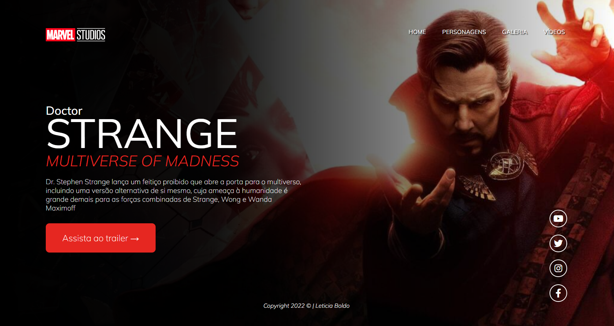
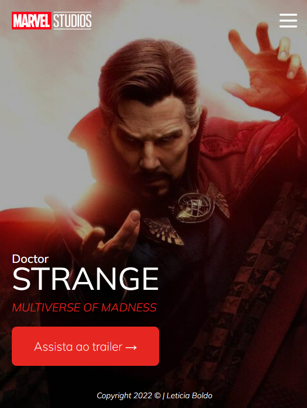
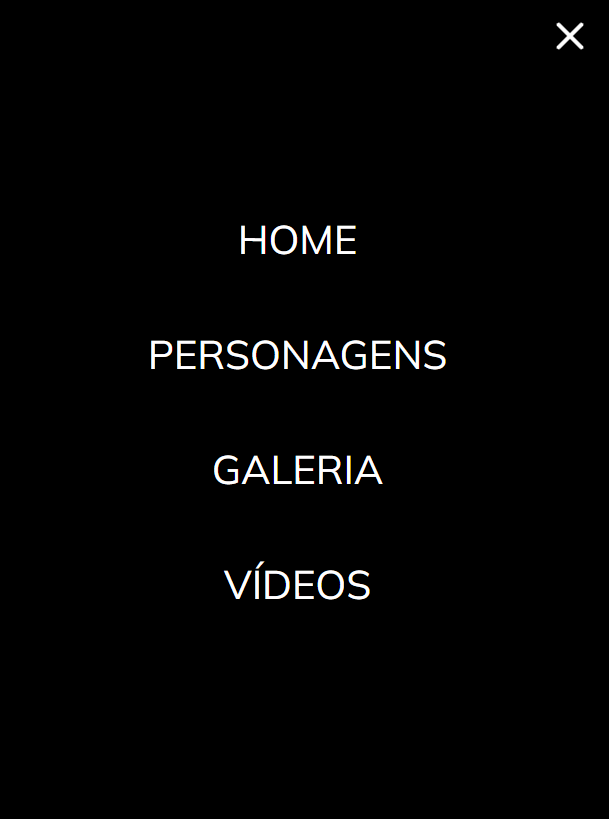

# Projeto - Landing Page

> Doutor Estranho 2

Projeto construido como aplicação de estudo, utilizando um projeto do figma com conteúdo iniciante na criação de websites com responsivo.

[Clique aqui para acessar](https://leboldo.github.io/Projeto-Landing-Page/#)

## Tecnologias

-HTML
-CSS
-Javascript
-Git e Github

## Visualizando o Projeto - Pagina Mobile

## Visualizando o Projeto - Menu Mobile

## Contato

boldoleticia@gmail.com 🧡
